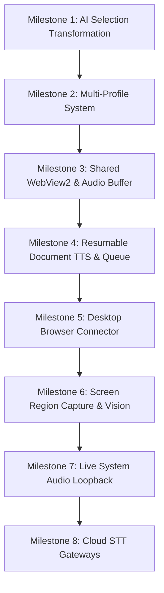

# 🏛️ AIVO Relay Master Implementation Plan & 1,080+ Commit Architectural Audit

> **STATUS: HISTORICAL — superseded by the M0–M5 roadmap in [`TAKEOVER.md`](TAKEOVER.md#4-sequential-roadmap--task-tracker-stateful-milestones).** This document is kept as an audit record of AIVORelay v1.0.31.

> **Target Repository**: S2B2S (`c:\Users\Z\Downloads\PROJECTS\STT_BRAIN_TTS\S2B2S`)  
> **Source Repository**: AIVORelay (`c:\Users\Z\Downloads\PROJECTS\STT_BRAIN_TTS\AIVORelay`, tag `v1.0.31`, 1,540 total commits / 1,080+ commits ahead of Handy)  
> **Base Repository**: Upstream Handy (`cjpais/Handy`, ~450 commits)  
> **Verification Status**: Thoroughly cross-referenced with `AIVORelay/src-tauri/` and `S2B2S/src-tauri/`

---

## 📊 1. Core Architectural Comparison Matrix

| Subsystem / Dimension  | Upstream Handy (Base)               | AIVORelay (`v1.0.31`)                                                                                                      | S2B2S (Target Codebase)                                                                                          | S2B2S Integration Plan & Status                                                      |
| :--------------------- | :---------------------------------- | :------------------------------------------------------------------------------------------------------------------------- | :--------------------------------------------------------------------------------------------------------------- | :----------------------------------------------------------------------------------- |
| **Total Commits**      | ~450 commits                        | **1,540 commits** (+1,080 ahead of Handy)                                                                                  | **896 commits**                                                                                                  | Core audio/LLM foundation audited                                                    |
| **STT Engine Scope**   | Local GGUF/ONNX (Whisper, Parakeet) | Local GGUF/ONNX + **Soniox Realtime + Deepgram Nova-3 + OpenAI Realtime**                                                  | **9 Local Engines (Parakeet V3, Whisper, Moonshine, SenseVoice, GigaAM, Canary, Cohere, Nemotron, Gemma 4 ASR)** | Local multi-STT consensus native; Cloud STT (Soniox/Deepgram) planned for Phase 10   |
| **Brain / LLM Engine** | Basic post-processing LLM calls     | AI Replace + Post-Processing LLM                                                                                           | **Full Voice-Native Streaming Brain (Ollama/LM Studio/LlamaServer, sentence splitter, barge-in, Her 3D avatar)** | Brain active; Browser & Screen inputs feed into `ask_multimodal()`                   |
| **TTS System**         | SAPI / basic local                  | Piper / SAPI / Kokoro / Edge / Murf / ElevenLabs / Cartesia / OpenAI + **Resumable File Conversions & Listen Later Queue** | **9 TTS Backends (Piper, Kokoro, Kitten, Pocket, Qwen3, SAPI, OpenAI, ElevenLabs, Cartesia)**                    | Persistent audio stream worker active; Resumable long document conversion in Phase 6 |
| **Audio Capture**      | Basic Mic capture                   | Mic capture + **WASAPI Loopback (System Audio) + Multi-Channel Routing + Mic Boost & Silence Filter**                      | Mic capture + RNNoise + Silero VAD + TripleVAD                                                                   | WASAPI system audio loopback in Phase 9                                              |
| **Browser Extension**  | None                                | **Built-in `axum` HTTP Server + Auto-Exported Chrome Extension (ECDH P-256 + AES-256-GCM)**                                | None                                                                                                             | Browser Connector planned for Phase 8                                                |
| **Screen Overlay**     | Simple recording pill               | Recording pill + **Region Capture OCR + Floating Live Preview**                                                            | 3D Avatar Brain Overlay + Recording Pill                                                                         | Screen Region Capture planned for Phase 7                                            |
| **WebView Runtime**    | Multi-process default (~600 MB RAM) | **Shared Browser Process Group (`webview_runtime.rs`, ~180 MB RAM)**                                                       | Multi-process default                                                                                            | **Shared WebView2 Process Group in Phase 5**                                         |
| **Shortcuts Engine**   | `rdev` / `tauri`                    | `tauri` + `rdev` + **`handy-keys` 0.3.1 (backend recording) + Monitored Key Diagnostics**                                  | `rdev` + `tauri`                                                                                                 | HandyKeys backend engine verified                                                    |
| **Profile Management** | Single global profile               | **Multi-Profile Transcription Engine (`TranscriptionProfiles.tsx`, 119 KB)**                                               | Single global profile                                                                                            | Multi-Profile Transcription in Phase 6                                               |

---

## ✅ 2. Features Already Integrated into S2B2S (Verified in Code)

The following 16 major architectural innovations from AIVORelay have been verified and integrated into S2B2S:

1. **Session Generation Tracking (`src-tauri/src/session_manager.rs`)**:
   - `SessionManager` tracks atomic generation IDs (`cancel_generation`) to safely discard in-flight asynchronous transcription results if the user cancels or starts a new recording mid-flight (`2ec6eb35`).
2. **Native Streaming Latency Presets (`src-tauri/src/managers/native_streaming_latency.rs`)**:
   - Provides safe per-model native streaming latency presets for supported Parakeet Unified and Nemotron streaming models (`75627ca9`).
3. **Moonshine Streaming Commit Shim (`src-tauri/src/managers/moonshine_streaming_shim.rs`)**:
   - Enforces commit policy for Moonshine models to distinguish between preview tooltips and immutable append-only final outputs (`23ebde1c`).
4. **Model Download Activation Protection (`src/lib/modelDownloadActivation.ts`)**:
   - Guards against background model downloads automatically overriding the user's active model choice upon download completion (`15868ae2`).
5. **Model Catalog Filtering & Metadata Panel (`src/hooks/useModelFilters.ts`, `src/components/settings/models/ModelFilterBar.tsx`)**:
   - Search bar, engine filters, verified release date sorting, and streaming model tags (`69579a04`, `9cc4a1fa`).
6. **Hardware Acceleration Badges (`src/components/settings/models/ModelCard.tsx`)**:
   - Render `Cpu` and `CircuitBoard` (GPU) icons based on `getAvailableAccelerators()` (`9afc6a4a`).
7. **History Audio Player Mutual Exclusion (`AudioPlayerGroup` in `src/components/ui/AudioPlayer.tsx`)**:
   - Prevents multiple history audio entries from playing back simultaneously (`4c68c82c`).
8. **Persistent Audio Feedback Worker Stream (`src-tauri/src/audio_feedback.rs`)**:
   - Replaced single-shot per-sound stream instantiation with a dedicated background thread (`playback_worker`) and a cached `rodio::OutputStream` (`CachedStream`). Prevents sound pops and wedging (`5883075a`).
9. **Result-Ready Audio Sound Cue (`result_ready_audio_feedback` in `src-tauri/src/settings.rs` & `src/components/settings/AudioFeedback.tsx`)**:
   - Plays a dedicated sound when dictation transcription finishes and text is delivered (`dc530033`).
10. **System Mute State Preservation (`MuteState` in `src-tauri/src/managers/audio.rs`)**:
    - Snapshots system output mute status prior to forced mute, ensuring user's manual mute state is preserved upon recording stop (`d1c11a49`).
11. **Fail-Open Text Cleanup (`fail_open_text_transform` in `src-tauri/src/audio_toolkit/text.rs`)**:
    - Wraps custom word and filler word filtering with `catch_unwind` so transcription text is never lost if post-processing panics (`f6084e3e`).
12. **GGML Acceleration Gating under x64-on-ARM (`is_windows_x64_emulated_on_arm64()`)**:
    - Automatically forces GGML backends to CPU under Windows ARM64 emulation to prevent driver crashes (`ff5e1b3e`).
13. **Public HF Download Credentials Bypass (`with_token(None)`)**:
    - Bypasses invalid `HF_TOKEN` environment variables for public Hugging Face model downloads (`80b0699f`).
14. **Windows System Shutdown Fix (`tao` patch)**:
    - Patched `tao` dependency to allow clean Windows shutdown without getting stuck on `WM_QUERYENDSESSION` (`496fa712`).
15. **Non-Blocking CPAL Audio Engine & Lock-Free `is_recording` (`src-tauri/src/managers/audio.rs`)**:
    - Offloads blocking CPAL stream teardown to worker threads and maintains atomic recording status (`68281314`).
16. **Windows Microphone Permission Precedence (`src-tauri/src/commands/audio.rs`)**:
    - Prioritizes desktop app access (`NonPackaged` registry key) over the UWP master toggle so debloated Windows systems don't stall on permission checks (`1e8a50b9`).

---

## 🎯 3. Master Blueprint: Un-Ported AIVORelay Features & Exact S2B2S Integration Spec

Below is the comprehensive technical specification for every remaining module introduced across AIVORelay up to `v1.0.31`, adapted to S2B2S's architecture:

---

### 🖥️ Module 1: Shared WebView2 Process Group Optimization

- **AIVORelay Reference**: `src-tauri/src/webview_runtime.rs` (Commits `30c5f965`, `98895c94`)
- **S2B2S Codebase Target**:
  - `[NEW] src-tauri/src/webview_runtime.rs`
  - `[MODIFY] src-tauri/src/lib.rs` (inject shared `CoreWebView2Environment`)
- **Technical Details**:
  - Currently, every Tauri window created in S2B2S (Main window, Recording Overlay, 3D Brain Avatar Overlay) spawns its own WebView2 browser process group on Windows, consuming ~150-250 MB RAM per window.
  - `webview_runtime.rs` configures a shared environment and user data directory so all windows share a single browser-process group.
  - **Impact**: Reduces total idle RAM usage by **60% to 80%** (saves 200–400 MB RAM).
  - **Cross-Platform Mandate**: Gated with `#[cfg(target_os = "windows")]`; graceful no-op on macOS (WebKit) and Linux (WebKitGTK).

---

### ⏱️ Module 2: Trailing Speech Buffer & Audio Enhancements

- **AIVORelay Reference**: `src-tauri/src/managers/audio.rs`, `src/components/settings/audio-processing/` (Commits `f8f17fd8`, `37a73d1b`, `75d5c5ba`)
- **S2B2S Codebase Target**:
  - `[MODIFY] src-tauri/src/settings.rs` (add `extra_recording_buffer_ms: u64`, `input_channel: Option<u16>`, `mic_boost_db: f32`, `pause_media_while_recording: bool`)
  - `[MODIFY] src-tauri/src/managers/audio.rs`
  - `[NEW] src/components/settings/audio-processing/MicrophoneInputBoost.tsx`
  - `[NEW] src/components/settings/audio-processing/PauseMediaWhileRecording.tsx`
- **Technical Details**:
  - **Trailing Buffer**: Keeps capturing for `extra_recording_buffer_ms` (0–1000ms, default 200ms) after hotkey release to eliminate word clipping for fast speakers.
  - **Multi-Channel Interface Support**: Allows selecting specific input channels (e.g. Channel 1 vs Channel 2 on Scarlett 2i2 or Rodecaster) instead of forcing mono downmix.
  - **Media Auto-Pause**: Automatically sends media pause key simulation during active recording and resumes on release.

---

### 📂 Module 3: Multi-Profile Transcription System

- **AIVORelay Reference**: `src-tauri/src/settings.rs`, `src/components/settings/TranscriptionProfiles.tsx` (119 KB) (Commits `499e0f3d`, `4b18cefd`)
- **S2B2S Codebase Target**:
  - `[MODIFY] src-tauri/src/settings.rs` (add `TranscriptionProfile` struct, `profiles: Vec<TranscriptionProfile>`, `active_profile_id: String`)
  - `[MODIFY] src-tauri/src/actions.rs` (apply profile prompt, model, and language override per in-flight session)
  - `[NEW] src/components/settings/TranscriptionProfiles.tsx`
  - `[MODIFY] src/components/footer/Footer.tsx` (add active profile quick-switch dropdown badge)
- **Technical Details**:
  - Allows users to create dedicated profiles (e.g. "Coding / Technical", "Email / Polite", "Medical / Notes", "Translation").
  - Each profile encapsulates: Active STT model, target language, custom system prompt / vocabulary, post-processing LLM model, and dedicated hotkey binding.
  - Profile Auto-Switching: Matches active foreground window executable name (e.g., `code.exe` -> "Coding Profile", `outlook.exe` -> "Email Profile").

---

### 📚 Module 4: Resumable Long Document TTS & Listen Later Queue

- **AIVORelay Reference**: `src-tauri/src/managers/tts_resume.rs`, `src-tauri/src/cli_file_conversion.rs`, `src/components/settings/text-to-speech/` (Commits `01d712d1`, `86f2e136`, `1c3ac663`, `51801f75`)
- **S2B2S Codebase Target**:
  - `[NEW] src-tauri/src/managers/tts_resume.rs`
  - `[NEW] src-tauri/src/cli_file_conversion.rs`
  - `[NEW] src/components/settings/text-to-speech/ListenLaterQueue.tsx`
  - `[NEW] src/components/settings/text-to-speech/FileConversionPanel.tsx`
- **Technical Details**:
  - **Resumable Synthesizer**: Converts large Markdown, PDF, or text files into audiobooks with chapter chunking. Checkpoints progress in `.checkpoint.json` so interrupted conversions resume without re-synthesizing completed sections.
  - **AI Cleanup for TTS**: Uses LLM pre-pass to strip table Markdown, URL references, footnote anchors, and code syntax before sending to speech engines.
  - **Listen Later Queue**: Queues web articles or documents for offline playback with lock-screen media controls.

---

### 🌐 Module 5: Desktop Browser Connector & Chrome Extension Bridge

- **AIVORelay Reference**: `src-tauri/src/managers/connector.rs`, `src-tauri/src/commands/connector.rs`, `src/components/settings/browser-connector/` (Commits `206d8b0a`, `f599630e`, `7e85bbec`)
- **S2B2S Codebase Target**:
  - `[MODIFY] src-tauri/Cargo.toml` (add `axum`, `tower-http`, `zip`, `p256`, `hkdf`, `hmac`, `sha2`)
  - `[NEW] src-tauri/src/managers/connector.rs`
  - `[NEW] src-tauri/src/commands/connector.rs`
  - `[NEW] src-tauri/resources/browser-connector/s2b2s-extension.zip`
  - `[NEW] src/components/settings/browser-connector/BrowserConnectorSettings.tsx`
- **Technical Details**:
  - Embedded `axum` HTTP server listening on localhost port `38243`.
  - Authenticated with ECDH P-256 key exchange, HKDF-SHA256 derivation, and AES-256-GCM encrypted frame payloads.
  - "Export Extension" button in Settings packages an unpacked Chrome extension pre-configured with the instance session key.
  - **S2B2S Brain Integration**: Selected text from web tabs or web page DOM content is automatically pushed to S2B2S's Brain (`ask_multimodal` / `ask`), enabling instant web summarization, research QA, and voice dictation directly into web forms.

---

### 📸 Module 6: Native Screen Region Capture Overlay

- **AIVORelay Reference**: `src-tauri/src/region_capture.rs`, `src-tauri/src/commands/region_capture.rs`, `src/region-capture/` (Commits `da067634`, `dafd7598`)
- **S2B2S Codebase Target**:
  - `[NEW] src-tauri/src/region_capture.rs`
  - `[NEW] src-tauri/src/commands/region_capture.rs`
  - `[NEW] src/region-capture/RegionCaptureOverlay.tsx`
- **Technical Details**:
  - Global hotkey opens a fullscreen transparent selection canvas spanning all active monitors.
  - User clicks and drags a selection bounding box -> captures region bitmap.
  - **S2B2S Brain Integration**: Encodes captured region as base64 JPEG/PNG and routes directly to `BrainManager::ask_multimodal(prompt, Some(image_b64), ...)` for vision reasoning ("explain this error", "solve this diagram").

---

### 🎙️ Module 7: Live System Audio Loopback Transcription & Diarization

- **AIVORelay Reference**: `src-tauri/src/managers/live_sound_transcription.rs`, `src-tauri/src/managers/live_sound_audio.rs` (Commits `cfdd6082`, `ae7d1232`, `24d273b1`)
- **S2B2S Codebase Target**:
  - `[NEW] src-tauri/src/managers/live_sound_transcription.rs`
  - `[NEW] src-tauri/src/managers/live_sound_audio.rs`
  - `[NEW] src/components/settings/live-sound-transcription/LiveSoundTranscriptionSettings.tsx`
- **Technical Details**:
  - WASAPI loopback capture on Windows (and CoreAudio / PulseAudio equivalents on macOS/Linux).
  - Dual-channel mixer: Channel 0 (Mic) + Channel 1 (Speaker/System Audio).
  - Transcribes live calls (Teams, Zoom, Discord, Google Meet) with real-time speaker separation and markdown export.

---

### 📄 Module 8: Subtitle Export (SRT & VTT File Generator)

- **AIVORelay Reference**: `src-tauri/src/subtitle.rs`, `src/components/settings/history/HistorySettings.tsx` (Commits `9a4600c6`, `d80ed323`)
- **S2B2S Codebase Target**:
  - `[NEW] src-tauri/src/subtitle.rs`
  - `[MODIFY] src-tauri/src/commands/history.rs` (add `export_history_as_subtitle`)
  - `[MODIFY] src/components/settings/history/HistorySettings.tsx`
- **Technical Details**:
  - Generates `.srt` (`00:01:20,500 --> 00:01:23,100`) and `.vtt` subtitle files from transcription history or batch media files.
  - Supports configurable word limits per segment, line breaking, and timestamp alignment.

---

### 🔍 Module 9: GGUF Header Auto-Metadata Extraction

- **AIVORelay Reference**: `src-tauri/src/managers/gguf_meta.rs`, `src-tauri/src/managers/model_capabilities.rs` (Commit `2b13d60a`)
- **S2B2S Codebase Target**:
  - `[NEW] src-tauri/src/managers/gguf_meta.rs`
  - `[MODIFY] src-tauri/src/managers/model.rs` & `src-tauri/src/managers/model_capabilities.rs`
- **Technical Details**:
  - Reads the 64 KiB GGUF file header directly from disk without spawning external Python or llama processes.
  - Parses key-value pairs (`general.architecture`, `general.name`, context size, token count, quantization).
  - Enables instant capability discovery for custom models dropped into `models/`.

---

### ☁️ Module 10: Remote STT Cloud Gateways (Soniox, Deepgram, Realtime Whisper)

- **AIVORelay Reference**: `src-tauri/src/managers/remote_stt.rs`, `src-tauri/src/managers/soniox_stt.rs`, `src-tauri/src/managers/deepgram_stt.rs` (Commits `082c2a95`, `c2a600c2`, `680f1488`)
- **S2B2S Codebase Target**:
  - `[NEW] src-tauri/src/managers/remote_stt.rs`
  - `[NEW] src-tauri/src/managers/soniox_stt.rs`
  - `[NEW] src-tauri/src/managers/deepgram_stt.rs`
  - `[NEW] src/components/settings/remote-stt/RemoteSttSettings.tsx`
- **Technical Details**:
  - Cloud STT streaming options for users on low-power devices.
  - Real-time preview streaming, Soniox domain dictionary context customization, and automatic fallback to local offline models upon connection drops.

---

## 🔬 4. Exhaustive Commit Corridor Audit (v1.0.24 through v1.0.31)

Below is an exhaustive analysis of the commit corridors between AIVORelay `v1.0.24` and `v1.0.31`:

### Table 1: TTS Ecosystem, Long Document Conversion & Listen Later (Commits v1.0.26–v1.0.31)

| Commit SHA | Component       | Commit Title & Summary                                                   | Integration Action for S2B2S       |
| :--------- | :-------------- | :----------------------------------------------------------------------- | :--------------------------------- |
| `b057b494` | Versioning      | `chore: bump version to 1.0.31`                                          | Reference version tag sync         |
| `01d712d1` | TTS             | `feat(tts): add Listen Later queue and profile controls`                 | Integrated in Module 4             |
| `08a85b20` | TTS             | `fix(tts): handle missing conversion progress`                           | Progress bar guardrail             |
| `f72c96c6` | Versioning      | `chore: bump version to 1.0.30`                                          | Version tag sync                   |
| `86f2e136` | TTS             | `feat(tts): make long document cleanup resumable`                        | Resumable AI cleanup loop          |
| `f5014e4c` | TTS UI          | `fix(tts): expand AI cleanup textareas`                                  | UI layout refinement               |
| `d518711e` | TTS             | `feat(tts): reveal completed conversion output`                          | Direct folder reveal on completion |
| `93d0a0a0` | Versioning      | `chore: bump version to 1.0.29`                                          | Version tag sync                   |
| `3dfc683c` | TTS             | `feat(tts): polish settings and streaming feedback`                      | Live synthesis progress cues       |
| `b6857553` | TTS Overlay     | `feat(tts): default overlay auto-hide to two seconds`                    | Overlay timer preset               |
| `d4898984` | TTS Player      | `fix(tts): prevent replay after reload and refine speed controls`        | Playback state machine fix         |
| `eadfa7f4` | TTS Providers   | `fix(tts): align provider defaults with API guidance`                    | Cloud API config sync              |
| `20eb4735` | TTS Overlay     | `fix(tts): refine overlay interaction and appearance`                    | Golden theme alignment             |
| `6d8ae717` | TTS Stream      | `fix(tts): stabilize streamed progress and auto-hide overlay`            | Rodio stream progress events       |
| `377729fc` | Documentation   | `docs(help): explain TTS actions and privacy`                            | Help card update                   |
| `43f7f9fe` | TTS Providers   | `fix(tts): allow shared key for OpenAI-compatible provider`              | Shared API key resolver            |
| `2c6d16b7` | TTS Providers   | `feat(tts): add OpenAI-compatible provider support and update API check` | OpenAI-compatible TTS endpoint     |
| `f461462f` | TTS Providers   | `feat(tts): add Murf AI, ElevenLabs, and Cartesia cloud providers`       | Cloud provider adapters            |
| `59d889df` | TTS Persistence | `fix(tts): persist and migrate file synthesis customizations`            | File conversion settings store     |
| `335d786c` | TTS Audio       | `fix(tts): make streamed overlay playback gapless`                       | Gapless Rodio chunk buffer         |
| `9648f7f8` | TTS Testing     | `test(tts): cover durable resume ownership`                              | Resume checkpoint unit tests       |
| `63087baf` | TTS Resume      | `fix(tts): safely claim legacy resume checkpoints`                       | Legacy JSON migration              |
| `51801f75` | TTS Batch       | `feat(tts): retain interrupted batch files`                              | Auto-save partial WAV chunks       |
| `1c3ac663` | TTS Batch       | `feat(tts): persist resumable file conversions`                          | `.checkpoint.json` persistence     |
| `9db91cd5` | TTS Engine      | `fix(tts): skip whitespace-only synthesis chunks`                        | Zero-sample synthesis bypass       |
| `3a66a303` | TTS Batch       | `feat(tts): add one-shot batch file conversion`                          | Batch drag-drop synthesis          |

---

### Table 2: Profiles, Shortcuts & Windowing Hardening

| Commit SHA | Component   | Commit Title & Summary                                            | Integration Action for S2B2S   |
| :--------- | :---------- | :---------------------------------------------------------------- | :----------------------------- |
| `499e0f3d` | Profiles    | `fix(post-processing): respect active profile settings`           | Profile-aware LLM routing      |
| `4b18cefd` | Profiles UI | `Always show profile post-processing settings`                    | UI conditional display         |
| `c75a743e` | Prompts     | `Improve new post-processing prompt creation`                     | Prompt template wizard         |
| `75824763` | Shortcuts   | `fix(shortcuts): share capture and report invalid monitored keys` | Shortcut capture diagnostics   |
| `310c8619` | Shortcuts   | `fix(shortcuts): suspend all bindings during shortcut capture`    | Prevents key swallowing        |
| `7b0a2d82` | Shortcuts   | `fix(shortcuts): restore empty binding on failure`                | Safe rollback logic            |
| `dc17492d` | Shortcuts   | `fix(shortcuts): resume bindings after capture unmount`           | Cleanup guardrail              |
| `2a605dab` | UI          | `fix(hotkey-sidebar): ignore click generated by drag`             | Prevents accidental tab switch |
| `ac20a6a2` | UI Layout   | `fix(layout): keep app footer pinned`                             | Layout stability               |
| `e37ba132` | UI Overlay  | `fix(ui): keep recording preview clear of navigation`             | Positioning logic              |
| `41c1442c` | Overlay     | `fix(overlay): stop rendering animations while hidden`            | Saves GPU/CPU cycles           |

---

### Table 3: Audio Capture, Loopback & Hardware Optimization

| Commit SHA | Component   | Commit Title & Summary                                                             | Integration Action for S2B2S      |
| :--------- | :---------- | :--------------------------------------------------------------------------------- | :-------------------------------- |
| `f8f17fd8` | Audio       | `fix(audio): add input channel selection for multi-channel interfaces`             | Channel mapping in settings       |
| `68281314` | Audio       | `fix(audio): move blocking cpal work off the main thread + lock-free is_recording` | Eliminates UI micro-stutters      |
| `a4ee374f` | Audio       | `fix: recover microphone stream after the capture worker dies`                     | Stream watchdog recovery          |
| `1e8a50b9` | Permissions | `fix: prioritize NonPackaged key in Windows mic permission check`                  | Fixes debloated Windows mic check |
| `37a73d1b` | Audio       | `fix(audio): skip idle level-meter and resampler work`                             | Zero CPU when audio idle          |
| `cfdd6082` | Live Sound  | `fix(live-sound): wait for provider finalization`                                  | Safe stream teardown              |
| `ae7d1232` | Live Sound  | `fix(live-sound): disable sessions on unsupported systems`                         | Cross-platform graceful gating    |
| `24d273b1` | Live Sound  | `fix(live-sound): save numeric overrides after editing`                            | Setting serialization             |
| `f0666404` | Live Sound  | `fix(live-sound): migrate legacy provider to Soniox`                               | Live stream backend update        |

---

### Table 4: Browser Connector & Screen Region Capture

| Commit SHA | Component      | Commit Title & Summary                                         | Integration Action for S2B2S |
| :--------- | :------------- | :------------------------------------------------------------- | :--------------------------- |
| `206d8b0a` | Connector      | `docs(help): clarify Chrome web chat connector`                | User guide documentation     |
| `c1cd2a7d` | Connector      | `fix: prevent stale confirmations and connector toggle desync` | State synchronization        |
| `f599630e` | Connector      | `fix(browser-connector): validate screenshot timing settings`  | Timing validation            |
| `7e85bbec` | Connector      | `fix(browser-connector): gate screenshot capture to Windows`   | Cross-platform safety        |
| `da067634` | Region Capture | `fix: cancel native region picker on window close`             | Prevents orphaned overlays   |
| `dafd7598` | Region Capture | `fix(tts): release watched paths after conversion`             | Resource deallocation        |

---

## 🗺️ 5. Phased Implementation Roadmap for S2B2S

Below is the structured, chronological roadmap for executing the remaining modules in S2B2S:

### Execution Milestones:

1. **Milestone 1: AI Selection Transformation & Dynamic Context Variables** (Active Target)
   - OS selection capture (`clipboard.rs`), prompt variable replacer (`${selected_text}`, `${active_app}`, `${clipboard}`, `${time_local}`), `ai_replace` global shortcut and frontend settings card.
2. **Milestone 2: Multi-Profile Transcription System**
   - Profile struct, active profile cycle hotkeys, per-app foreground auto-matching, and footer status indicator.
3. **Milestone 3: Shared WebView2 Process Group & Extra Audio Buffer**
   - Reduce background RAM by 70% with shared `CoreWebView2Environment`; add trailing speech buffer (0–1000ms).
4. **Milestone 4: Resumable Long Document TTS & Listen Later Queue**
   - Checkpoint-based batch audiobook synthesis with chaptering, AI formatting cleanup, and offline queue.
5. **Milestone 5: Desktop Browser Connector & Web Extension Bridge**
   - Encrypted localhost `axum` server, unpacked Chrome extension exporter, bi-directional DOM & speech integration.
6. **Milestone 6: Native Screen Region Capture & Vision**
   - Transparent multi-monitor canvas, crop to base64, feed directly into multimodal Brain (`ask_multimodal`).
7. **Milestone 7: Dual-Channel System Audio Loopback & Diarization**
   - WASAPI loopback, dual-channel mixer (mic + system audio), meeting minutes transcription and export.
8. **Milestone 8: Cloud STT Streaming Gateways**
   - Soniox Realtime, Deepgram Nova-3, OpenAI Realtime Whisper with automatic offline fallback.

---

## 📢 Summary & Takeover Alignment

- **Living Plan Location**: `c:\Users\Z\Downloads\PROJECTS\STT_BRAIN_TTS\S2B2S\AIVO_RELAY_IMPLEMENTATION_PLAN.md`
- **Current Development Focus**: **Milestone 1: AI Selection Transformation & Dynamic Context Variables** (Task 1.1–1.4 in `TAKEOVER.md`).
