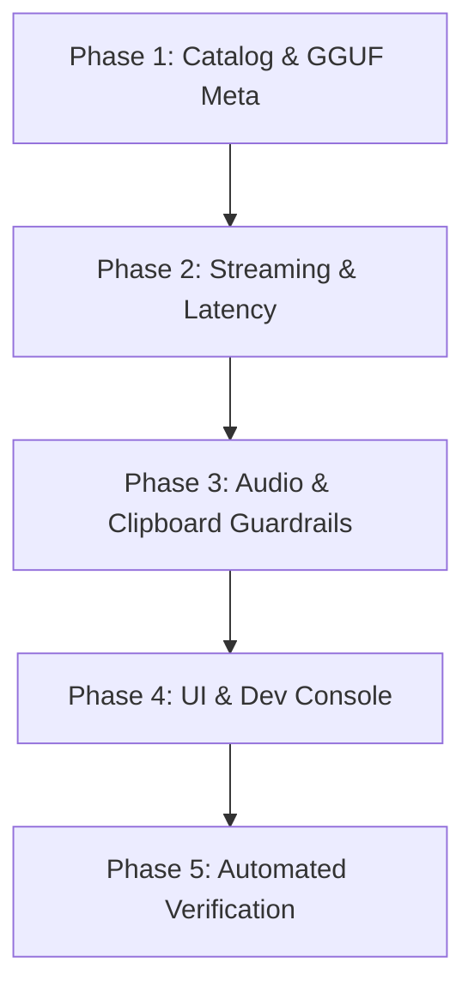

# AIVO Update Integration Plan for S2B2S

This document outlines the detailed roadmap for integrating all major features, performance optimizations, guardrails, and UI enhancements introduced in **AIVORelay** (`MaxITService/AIVORelay` up to tag `v1.0.24`) into **S2B2S**, while preserving all of S2B2S's voice-native capabilities (9 TTS backends, Brain LLM, LlamaServer manager, 3D WGPU Brain overlay, continuous voice mode, and multi-language support).

---

## 1. Repository Location & Context

- **Target Project**: `S2B2S` (`c:\Users\Z\Downloads\PROJECTS\STT_BRAIN_TTS\S2B2S`)
- **Source Project**: `AIVORelay` (`c:\Users\Z\Downloads\PROJECTS\STT_BRAIN_TTS\AIVORelay`)
- **Source Upstream Branch**: `origin/main` (`v1.0.24`)

---

## 2. Core Architecture & System Modules to Integrate

### Phase 1: Model Catalog, Metadata & Capability Matrix Engine

1. **Catalog System**:
   - `src-tauri/src/catalog/catalog.json`: Full model metadata registry (sizes, capabilities, release dates, speed, accuracy ratings).
   - `src-tauri/src/catalog/mod.rs`: Rust catalog manager with fallback loading and serde structs.
   - `scripts/gen_catalog.py`: Python script for catalog regeneration.

2. **Model Capabilities Engine**:
   - `src-tauri/src/managers/model_capabilities.rs`: Hardware probe, CPU vs. GPU capability tags, memory requirements, native streaming support flags.

3. **GGUF Metadata Parser**:
   - `src-tauri/src/managers/gguf_meta.rs`: Native Rust binary parser for GGUF model headers to inspect architecture, context size, quantizations, and parameters directly from disk.

---

### Phase 2: Native STT Streaming & Latency Optimizations

1. **Low-Latency Streaming Engine**:
   - `src-tauri/src/managers/native_streaming_latency.rs`: Per-model latency tuning presets (ultra-low, balanced, high-accuracy).
   - `src-tauri/src/managers/moonshine_streaming_shim.rs`: Native streaming shim for Moonshine models.

2. **Transcription Manager Robustness**:
   - `src-tauri/src/managers/transcription.rs`:
     - Mutex poison recovery during drop.
     - Live preview update streaming fan-out.
     - Append-only protection for Moonshine live output.
   - `src-tauri/src/session_manager.rs`: Stale async result rejection using session generation IDs.

---

### Phase 3: Audio Recorder & Clipboard Guardrails

1. **Audio Recording Optimizations**:
   - `src-tauri/src/audio_toolkit/audio/recorder.rs`: Fast microphone startup, preferred device auto-selection logic, Unicode VAD model path handling.
   - `src-tauri/src/audio_toolkit/audio/resampler.rs`: Reset resampler state between recordings to eliminate click/pop artifacts.

2. **Clipboard & Post-Processing Guardrails**:
   - `src-tauri/src/clipboard.rs` & `src-tauri/src/actions.rs`: Serialized streaming paste restoration, blank/whitespace transcription skipping, ampersand (`&`) preservation in custom words.

---

### Phase 4: Model Management UI & Dev Console

1. **Enhanced Model Filtering & Selector UI**:
   - `src/hooks/useModelFilters.ts` & `src/lib/utils/modelReleaseDate.ts`: Filtering logic by release date, streaming support, CPU vs GPU, language support.
   - `src/components/settings/models/ModelFilterBar.tsx` & `ModelMetadataPanel.tsx`: UI filter bar, capability badges, model release date component.
   - `src/lib/modelDownloadActivation.ts` & `ModelDropdown.tsx`: Automatic activation UX after download and native streaming badges.

2. **Developer Experience & Debugging**:
   - `src/components/settings/debug/DevConsoleLogLevelSelector.tsx`: Dev console log level selector.
   - Session toast history in debug panel.

---

## 3. Implementation Order



---

## 4. Verification Plan

1. **TypeScript Type Checking**:
   ```bash
   bunx tsc --noEmit
   ```
2. **Rust Compilation & Binding Export**:
   ```bash
   cargo test export_bindings
   ```
3. **i18n Translation Check**:
   ```bash
   bun run check:translations
   ```
