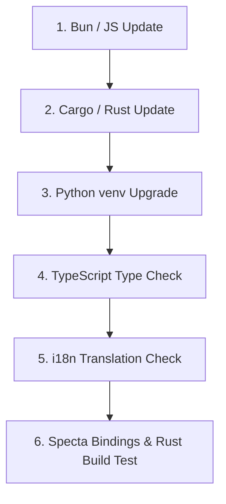

# One-Shot Multi-Language Dependency Upgrade Guide

S2B2S provides a single, unified command to automatically upgrade **all dependencies across all languages and toolchains** in one go:

```bash
bun run update:all
```

---

## What `bun run update:all` Does

When you execute `bun run update:all` (or `bun scripts/update-all-deps.ts`), the automation engine executes the following multi-stage pipeline:



### 1. Frontend JavaScript / TypeScript (Bun)

- Executes `bun update` at the project root.
- Upgrades all packages in `package.json` (React, Vite, Tailwind CSS, Tauri plugins, i18next, Zustand, Zod, Three.js) to their latest compatible releases and updates `bun.lock`.

### 2. Backend Rust Crates (Cargo)

- Executes `cargo update` in `src-tauri/`.
- Upgrades all 70+ Rust dependencies in `src-tauri/Cargo.lock` to their latest patch/minor releases (Tokio, Serde, Rustls, Clap, Time, Zbus, Tauri plugins, etc.).

### 3. Python Virtual Environment (TTS Engines)

- Detects local Python `venv/` at project root.
- Upgrades local TTS packages: `piper-tts`, `kokoro-tts`, `pocket-tts`, `kittentts`, `torch`, `numpy`, `soundfile`.

### 4. Automated Verification & Sanity Checks

- **TypeScript**: `bunx tsc --noEmit` verifies zero type errors.
- **i18n**: `bun scripts/check-translations.ts` verifies translation key consistency across all 23 supported languages.
- **Specta & Rust**: `cargo test export_bindings` regenerates `src/bindings.ts` and runs Rust unit tests to guarantee clean binary compilation.

---

## Available Script Commands

| Command                         | Purpose                                                               |
| :------------------------------ | :-------------------------------------------------------------------- |
| **`bun run update:all`**        | **One-shot upgrade of ALL dependencies across JS, Rust, and Python.** |
| **`bun scripts/check-deps.ts`** | Check current dependency version status without modifying files.      |
| **`bun install`**               | Install JavaScript dependencies from `bun.lock`.                      |
| **`cargo update`**              | Update Rust dependencies in `src-tauri/Cargo.lock`.                   |

---

## Cross-Platform Compatibility

The upgrade engine is written in native TypeScript/Bun and is fully cross-platform:

- **Windows 11**: Detects `venv\Scripts\python.exe`.
- **macOS / Linux**: Detects `venv/bin/python`.
