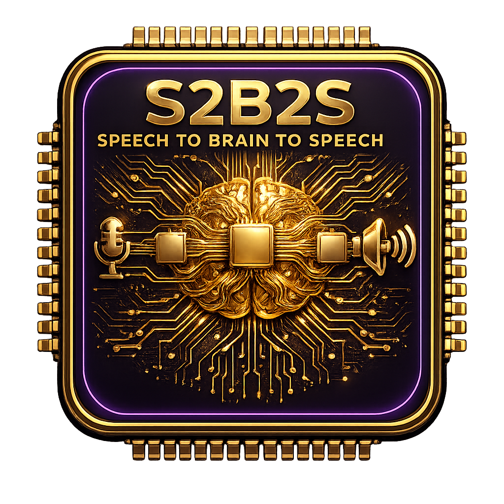

#  S2B2S — SpeechToBrainToSpeech

**Local-first STT → Brain → TTS desktop app for Windows 11, macOS, and Linux. Dictate anywhere, read anything aloud, and talk naturally with a local AI — almost keyboard-free.**

S2B2S is a cross-platform desktop application that combines speech-to-text (STT), a local or cloud "Brain" (LLM), and text-to-speech (TTS) into one unified voice-native experience. Built on the [Handy](https://github.com/cjpais/Handy) skeleton (MIT), S2B2S has evolved far beyond its origins — adding TTS read-aloud with 7+ backends (Piper, Kokoro, Kitten, OpenAI, ElevenLabs, Cartesia, SAPI), a streaming LLM conversation mode, double-copy clipboard trigger, and a full text normalization pipeline (ITN + TN + markdown stripping).

---

## Table of Contents

- [Why S2B2S?](#why-s2b2s)
- [How It Works](#how-it-works)
- [Quick Start](#quick-start)
- [Architecture](#architecture)
- [Default Stack](#default-stack)
- [The Three Pipelines](#the-three-pipelines)
- [CLI Parameters](#cli-parameters)
- [Platform Support](#platform-support)
- [System Requirements](#system-requirements)
- [Roadmap & Active Development](#roadmap--active-development)
- [Sponsors](#sponsors)
- [Related Projects](#related-projects)
- [License & Attribution](#license--attribution)

---

## Why S2B2S?

- **Local-first**: Everything works offline. Parakeet V3 for STT, Piper for TTS, Ollama/LM Studio for the Brain. No cloud required.
- **Open Source (MIT)**: Forkable, inspectable, extendable.
- **Private**: Your voice, text, and conversations stay on your machine. Keys stored in OS keychain.
- **Voice-native**: Designed for spoken interaction — not a text chat with voice bolted on.
- **Three superpowers in one app**: Dictate anywhere, read anything aloud, talk to a local brain.

---

## How It Works

1. **Dictate Anywhere** — press a hotkey, speak, and polished text lands at your cursor. Powered by **Parakeet V3** (default, local, 25 languages with auto-detection).
2. **Read Aloud** — select text anywhere, press a hotkey, and a local voice reads it instantly with pause/resume. Also triggered by **double-copy** (copy same text twice within 1.5s).
3. **Talk to the Brain** — the Conversation window: speak naturally to a local LLM (Ollama/LM Studio) or any cloud LLM. Real-time STT in, streaming tokens out, TTS reads the reply aloud (toggleable, default ON).

---

## Quick Start

### Installation

1. Download the latest release from the [releases page](https://github.com/NairoDorian/S2B2S/releases)
2. Install and grant microphone permissions
3. On first run, download **Parakeet V3** (~0.6 GB) — the default and recommended STT model
4. Configure your hotkeys and start transcribing!

### Development Setup

```bash
# Prerequisites: Rust (latest stable), Bun
bun install

# Download required models
mkdir -p src-tauri/resources/models
curl -o src-tauri/resources/models/silero_vad_v4.onnx https://blob.handy.computer/silero_vad_v4.onnx

# Run in development mode
bun run tauri dev

# On macOS if you encounter cmake errors:
CMAKE_POLICY_VERSION_MINIMUM=3.5 bun run tauri dev

# Build for production
bun run tauri build

# Regenerate typed bindings (frontend ↔ backend)
cargo test export_bindings

# Lint & Format
bun run lint
bun run format
```

For detailed platform-specific build instructions, see [BUILD.md](BUILD.md).

---

## Architecture

S2B2S is built as a **Tauri 2 application** with a Rust backend and React/TypeScript frontend:

```
┌─────────────────────────────────────────────────────────────────┐
│                     Tauri App (single process)                    │
│                                                                   │
│  ┌─────────────┐     ┌──────────────────────────────────────────┐│
│  │  React/TS   │◄───►│              Rust Core                    ││
│  │  Frontend   │ IPC │  (tauri-specta typed bindings)            ││
│  │             │     │                                            ││
│  │  Settings   │     │  managers/                                ││
│  │  Overlay    │     │   ├─ audio.rs (recording)                 ││
│  │  Conversation│     │   ├─ model.rs (downloads)                ││
│  │  History    │     │   ├─ transcription.rs (STT pipeline)      ││
│  │  Onboarding │     │   └─ history.rs (SQLite)                  ││
│  │  Her Loading│     │                                            ││
│  └─────────────┘     │  tts/ (Text-to-Speech subsystem)          ││
│                       │   ├─ backends/ (Piper, Kokoro, Kitten,   ││
│                       │   │   SAPI, OpenAI, ElevenLabs, Cartesia)││
│                       │   ├─ manager.rs (orchestration)          ││
│                       │   ├─ sanitize/ (ITN, TN, markdown strip) ││
│                       │   ├─ pagination.rs / fragment_queue.rs   ││
│                       │   ├─ player.rs (rodio playback)          ││
│                       │   └─ clipboard_watch.rs (double-copy)    ││
│                       │                                            ││
│                       │  brain/ (Streaming LLM)                  ││
│                       │   ├─ client.rs (SSE streaming)           ││
│                       │   └─ manager.rs (turn history, barge-in) ││
│                       │                                            ││
│                       │  audio_toolkit/                          ││
│                       │   ├─ audio/ (cpal capture, resample)     ││
│                       │   └─ vad/ (TripleVAD: RMS→RNNoise→Silero)││
│                       │                                            ││
│                       │  commands/ (Tauri command handlers)      ││
│                       │  shortcut/ (global hotkeys)              ││
│                       │  overlay.rs (recording/speaking overlay) ││
│                       │  settings.rs (persistence)               ││
│                       └──────────────────────────────────────────┘│
└─────────────────────────────────────────────────────────────────┘
```

### Frontend (React)

- **17+ components**: settings, model-selector, onboarding, conversation, overlay, footer, sidebar
- **20-language i18n** via i18next
- **Zustand** state management with typed bindings
- **Her-style 3D loading animation** (Three.js)
- Dark theme with purple (#7c3aed) + gold (#f59e0b) accents

### Backend (Rust)

- **Manager pattern**: Audio, Model, Transcription, History, TTS, Brain
- **TTS Backend trait**: 7+ engines with `WarmEngine` lifecycle
- **TripleVAD**: 3-stage voice activity detection (RMS → RNNoise → Silero)
- **Normalization pipeline**: ITN → Custom Words → TN → Markdown Strip → Regex Cleanup
- **Single instance** architecture with CLI remote control

### Core Libraries

| Crate | Version | Purpose |
|-------|---------|---------|
| `transcribe-rs` | 0.3.11 | Local STT (Parakeet V3 + Whisper) with GPU acceleration |
| `cpal` | 0.17 | Cross-platform audio I/O |
| `nnnoiseless` | 0.5.2 | RNNoise-based noise suppression |
| `vad-rs` | — | Silero VAD (ONNX) |
| `rdev` | — | Global keyboard shortcuts |
| `rubato` | 3.0 | Audio resampling |
| `rodio` | 0.22 | Audio playback |
| `tts-rs` | — | Kokoro-82M in-process ONNX TTS (54 voices, 9 languages) |
| `text-processing-rs` | 0.2.2 | ITN + TN normalization |
| `pulldown-cmark` | 0.13 | Markdown → speakable text |
| `rusqlite` | 0.40 | SQLite persistence |
| `reqwest` | 0.13 | HTTP client |
| `tauri-specta` | — | Typed IPC bindings |

---

## Default Stack

S2B2S works fully offline with no configuration. The defaults are chosen for speed, privacy, and broad hardware compatibility:

| Layer | Default | Alternatives |
|-------|---------|-------------|
| **STT** | **Parakeet TDT 0.6B V3** (auto language, 25 langs, CPU-fast) | Whisper (Small/Medium/Turbo/Large), Moonshine |
| **VAD** | **TripleVAD** (RMS→RNNoise→Silero) | Silero only, Push-to-talk |
| **Noise Suppression** | RNNoise (toggleable, triple mode default) | Off |
| **TTS** | **Piper** persistent HTTP server (speed-first, warm) | Kokoro-82M (quality-first), Kitten, SAPI, OpenAI, ElevenLabs, Cartesia |
| **Brain** | **Ollama** auto-detected (`:11434`) / **LM Studio** (`:1234`) | Any OpenAI-compatible API, Anthropic, Gemini |
| **Storage** | SQLite (rusqlite + migrations) | — |
| **Secrets** | OS keychain (Windows Credential Manager, macOS Keychain) | — |

---

## The Three Pipelines

### Dictation Pipeline
```
Microphone → TripleVAD (RMS→RNNoise→Silero) → Parakeet V3 STT → ITN Normalization → Clipboard/Paste
```

### Conversation Pipeline (Speech → Brain → Speech)
```
Microphone → TripleVAD → Parakeet V3 STT → ITN Normalization → LLM (Brain) → Markdown Strip → TN Normalization → TTS (Piper/Kokoro) → Speaker
```

### Read Aloud Pipeline
```
Selected Text (or double-copy clipboard) → Markdown Strip → TN Normalization → TTS → Speaker
```

### Text Normalization Pipeline (4-pass)
```
Post-STT:  ITN (text-processing-rs) → Custom Words (fuzzy correction)
Pre-TTS:   pulldown-cmark (markdown strip) → TN (text-processing-rs) → Regex Cleanup
```

| Pass | Direction | Example Input | Example Output |
|------|-----------|--------------|----------------|
| ITN | Spoken → Written | `two hundred thirty two` | `232` |
| ITN | Spoken → Written | `january fifth` | `January 5, 2025` |
| pulldown-cmark | Markdown → Speech | `**bold**` | `bold` |
| TN | Written → Spoken | `$5.50` | `five dollars and fifty cents` |
| TN | Written → Spoken | `Dr. Smith` | `doctor Smith` |

---

## CLI Parameters

```bash
s2b2s --toggle-transcription    # Toggle recording on/off
s2b2s --toggle-post-process     # Toggle with post-processing
s2b2s --cancel                  # Cancel current operation
s2b2s --start-hidden            # Start minimized to tray
s2b2s --no-tray                 # Start without tray icon
s2b2s --debug                   # Enable debug logging
```

Unix signals (Linux/macOS):
| Signal | Action |
|--------|--------|
| `SIGUSR2` | Toggle transcription |
| `SIGUSR1` | Toggle transcription with post-processing |

---

## Platform Support

| Platform | Status | Notes |
|----------|--------|-------|
| **Windows 11** | ✅ Primary | Full support, NSIS/MSI installers |
| **Windows 10** | ✅ Supported | Tested |
| **macOS** (Intel + Apple Silicon) | ✅ First-class | Metal acceleration, accessibility permissions required |
| **Linux** (x64) | ✅ First-class | Ubuntu 22.04/24.04, Arch, Fedora; Wayland with wtype/dotool |

### Linux Notes

**Text Input Tools:**
| Display Server | Tool | Install |
|---------------|------|---------|
| X11 | `xdotool` | `sudo apt install xdotool` |
| Wayland | `wtype` | `sudo apt install wtype` |
| Both | `dotool` | `sudo apt install dotool` (+ `input` group) |

**Wayland Global Shortcuts** must be configured through your desktop environment (GNOME, KDE, Sway, Hyprland). See the [troubleshooting section](#linux-startup-crashes-or-instability) for config examples.

---

## System Requirements

**Parakeet V3 (default STT):**
- CPU-only operation (no GPU required)
- Minimum: Intel Skylake (6th gen) or equivalent AMD
- Performance: ~5x real-time on mid-range hardware (tested on i5)
- 25 languages with automatic detection

**Whisper Models:**
- macOS: M series or Intel Mac
- Windows/Linux: Intel, AMD, or NVIDIA GPU recommended

**TTS Backends:**
- Piper: CPU-only, ~100-200 MB RAM per voice
- Kokoro-82M: CPU-only, ~115 MB + 50 MB per worker
- Cloud: Requires internet connection

---

## Roadmap & Active Development

S2B2S is the foundation of the SpeechToBrainToSpeech vision. The core STT → Brain → TTS pipeline is feature-complete. Current work focuses on performance, stability, and polish.

| Feature | Status |
|---------|--------|
| STT dictation (Parakeet V3, Whisper, Moonshine) | ✅ Complete |
| TTS read-aloud (Piper, Kokoro, Kitten, SAPI, OpenAI, ElevenLabs, Cartesia) | ✅ Complete |
| Conversation mode with streaming LLM (Ollama/LM Studio/OpenAI-compatible) | ✅ Complete |
| Double-copy clipboard trigger for speak-selection | ✅ Complete |
| Text normalization pipeline (ITN + TN + markdown stripping) | ✅ Complete |
| TripleVAD (RMS → RNNoise → Silero) with tunable threshold | ✅ Complete |
| Crash logging with full backtraces | ✅ Complete |
| Her-style 3D loading animation | ✅ Complete |
| 20-language i18n (ar, bg, cs, de, en, es, fr, he, it, ja, ko, pl, pt, ru, sv, tr, uk, vi, zh, zh-TW) | ✅ Complete |
| WarmEngine trait lifecycle (Loading→WarmingUp→Ready→Error) | ✅ Complete |
| TTS performance telemetry (chars_per_ms adaptive sizing) | ✅ Complete |
| Piper persistent HTTP server with CUDA auto-discovery | ✅ Complete |
| Cargo test export_bindings (headless typed bindings) | ✅ Complete |
| Kokoro worker pool + crossfade | 🚧 In progress |
| RAM-persistent warm model lifecycle (unload timeout) | 🚧 In progress |
| Streaming STT (WebSocket-based) | 📋 Planned |
| Pocket TTS backend (voice cloning) | 📋 Planned |
| Multi-OS polish, mobile companion | 📋 Later |

See the full planning document in [IMPROVEMENT_PLAN.md](IMPROVEMENT_PLAN.md).

---

## Known Issues & Current Limitations

### Major Issues (Help Wanted)

**Whisper Model Crashes:**
- Whisper models crash on certain system configurations (Windows and Linux)
- Does not affect all systems — configuration-dependent
- Parakeet V3 is the default (not affected); switch to Parakeet if Whisper crashes
- If you experience crashes, please provide debug logs (Ctrl+Shift+D)

**Wayland Support (Linux):**
- Limited support for Wayland display server
- Requires wtype or dotool for text input (see Linux Notes above)
- Overlay disabled by default on Linux to prevent focus-stealing issues

**Known Workarounds:**
- `S2B2S_NO_GTK_LAYER_SHELL=1` — skip GTK layer shell on Linux
- `WEBKIT_DISABLE_DMABUF_RENDERER=1` — fix WebKit rendering on some GPUs

---

## Troubleshooting

### Manual Model Installation

For proxy users or restricted networks, models can be downloaded manually:

1. Find your app data directory (shown in Settings → About)
2. Place Whisper `.bin` files or extracted Parakeet `.tar.gz` archives in the `models` folder
3. Restart S2B2S to detect them

Typical paths:
- **macOS**: `~/Library/Application Support/com.nairodorian.s2b2s/`
- **Windows**: `C:\Users\{username}\AppData\Roaming\com.nairodorian.s2b2s\`
- **Linux**: `~/.config/com.nairodorian.s2b2s/`

Model download URLs:
- Parakeet V3 (478 MB): `https://blob.handy.computer/parakeet-v3-int8.tar.gz`
- Whisper Small (487 MB): `https://blob.handy.computer/ggml-small.bin`

### Verify Release Signatures

```bash
ARTIFACT="S2B2S_0.9.0_amd64.AppImage"
python3 - "$ARTIFACT" <<'PY'
import base64, pathlib, sys
artifact = sys.argv[1]
pub = pathlib.Path("s2b2s.pub.b64").read_text().strip()
pathlib.Path("s2b2s.pub").write_bytes(base64.b64decode(pub))
sig = pathlib.Path(f"{artifact}.sig").read_text().strip()
pathlib.Path(f"{artifact}.minisig").write_bytes(base64.b64decode(sig))
PY
minisign -Vm "$ARTIFACT" -p s2b2s.pub -x "$ARTIFACT.minisig"
```

### Debug Mode

Press `Ctrl+Shift+D` (Windows/Linux) or `Cmd+Shift+D` (macOS) to toggle debug overlay. Also available in Advanced settings.

---

## How to Contribute

1. **Check existing issues** at [github.com/NairoDorian/S2B2S/issues](https://github.com/NairoDorian/S2B2S/issues)
2. **Fork the repository** and create a feature branch
3. **Test thoroughly** on your target platform
4. **Submit a pull request** with clear description of changes
5. **Join the discussion** — reach out at [contact@s2b2s.computer](mailto:contact@s2b2s.computer)

See [CONTRIBUTING.md](CONTRIBUTING.md) for detailed contribution guidelines and [AGENTS.md](AGENTS.md) for AI assistant guidance.

---

## Sponsors

<div align="center">
  We're grateful for the support of our sponsors who help make S2B2S possible:
  <br><br>
  <a href="https://wordcab.com">
    
  </a>
  &nbsp;&nbsp;&nbsp;&nbsp;&nbsp;&nbsp;
  <a href="https://github.com/epicenter-so/epicenter">
    
  </a>
  &nbsp;&nbsp;&nbsp;&nbsp;&nbsp;&nbsp;
  <a href="https://boltai.com?utm_source=s2b2s">
    
  </a>
</div>

---

## Related Projects

- **[Handy](https://github.com/cjpais/Handy)** — The original speech-to-text desktop app (MIT) that S2B2S is built upon
- **[Handy CLI](https://github.com/cjpais/handy-cli)** — Original Python command-line version
- **[Parakeet V3](https://github.com/nvidia/NeMo)** — 25-language STT model by NVIDIA (CC-BY-4.0)
- **[CopySpeak](https://github.com/yourfriendoss/copyspeak)** — TTS read-aloud patterns and warm-engine lifecycle
- **[Parrot](https://github.com/cjpais/parrot)** — Kokoro worker pool, crossfade, and markdown sanitization patterns
- **[AIVORelay](https://github.com/MaxITService/AIVORelay)** — Fork with streaming STT, profiles, and browser relay
- **[Parler](https://github.com/Melvynx/Parler)** — Fork with Gemini STT and long-audio routing

---

## License & Attribution

**S2B2S** — MIT License — see [LICENSE](LICENSE) file.

Built on [Handy](https://github.com/cjpais/Handy) by CJ Pais (MIT). Uses Parakeet V3 (CC-BY-4.0), Silero VAD, Kokoro-82M (Apache 2.0), text-processing-rs (Apache 2.0), Piper TTS, transcribe-rs, and the excellent Tauri framework.

Inspired by and incorporating patterns from: AIVORelay by MaxITService (MIT), Parler by Melvynx (MIT), Parrot by Rishi Khare (MIT), CopySpeak by ilyaizen & NairoDorian (MIT). Concepts from Whispering (AGPL-3.0), TranscriptionSuite (GPL-3.0), and Parakeet-Realtime-Transcriber (concepts only).

See [S2B2S_REVIEW.md](S2B2S_REVIEW.md) for the complete project analysis and [AGENTS.md](AGENTS.md) for AI assistant guidance.
