# ZER0 Dual-GPU & Vulkan Backend Architecture Plan (Rev 2.0)

**Target Project**: ZER0 (`Handy_V2`)  
**Companion Core**: `transcribe.cpp` (`c:\Users\Z\Downloads\PROJECTS\transcribe-fork`)  
**Detailed Technical Specification**: [`docs/2026-09-dual-gpu-vulkan-and-cuda-plan.md`](file:///C:/Users/Z/Downloads/PROJECTS/Handy_V2/docs/2026-09-dual-gpu-vulkan-and-cuda-plan.md)  
**Status**: Ready for Execution

---

## 1. Concurrency Architecture & Memory Topology

```mermaid
flowchart TD
    App["ZER0 Application (Handy_V2)"] --> Primary["Primary Model (e.g. Whisper Large v3 Turbo)"]
    App --> Secondary["Multi-STT Extra Model (e.g. Moonshine Base)"]

    subgraph NVIDIA_Subsystem["Discrete GPU: NVIDIA RTX 4070 Laptop (dGPU)"]
        Primary -->|Backend: CUDA| CudaSched["ggml_backend_sched_t (CUDA)"]
        CudaSched --> CudaDLL["ggml-cuda.dll"]
        CudaDLL --> NvDriver["NVIDIA Driver (nvwgf2um64.dll)"]
        NvDriver --> NvVRAM["8 GB Dedicated GDDR6 VRAM (~1.6 GB used)"]
    end

    subgraph Intel_Subsystem["Integrated GPU: Intel Iris Xe (iGPU)"]
        Secondary -->|Backend: Vulkan (Intel)| VkSched["ggml_backend_sched_t (Vulkan)"]
        VkSched --> VkDLL["ggml-vulkan.dll"]
        VkDLL --> IntelDriver["Intel Vulkan Driver (igvk64.dll)"]
        IntelDriver --> SharedRAM["Unified System DDR5 RAM (~400 MB used)"]
    end

    subgraph Audio_Pipeline["Audio Capture & Parallel Dispatch"]
        Mic["Microphone 16kHz Stream"] --> Dispatcher["Audio Stream Dispatcher"]
        Dispatcher -.->|Audio Frame 1| Primary
        Dispatcher -.->|Audio Frame 2| Secondary
    end
```

---

## 2. Granular Backend Selection Matrix

Every model (primary or Multi-STT extra slot) can be individually assigned to any available backend:

| UI Option           | Wire / Serde Name | Resolved Backend  | Device Binding       | Target Silicon & Memory               |
| :------------------ | :---------------- | :---------------- | :------------------- | :------------------------------------ |
| **Auto**            | `"auto"`          | Global Policy     | Global Setting       | Follows global accelerator            |
| **CPU**             | `"cpu"`           | `Backend::Cpu`    | `None`               | Intel Core i9-13900H (AVX2/VNNI)      |
| **CUDA**            | `"cuda"`          | `Backend::Cuda`   | `None`               | NVIDIA RTX 4070 (Native CUDA `sm_89`) |
| **Vulkan**          | `"vulkan"`        | `Backend::Vulkan` | `None` (Default)     | Default Vulkan GPU                    |
| **Vulkan (NVIDIA)** | `"vulkan_nvidia"` | `Backend::Vulkan` | `Some(NvidiaDevice)` | NVIDIA RTX 4070 (via Vulkan API)      |
| **Vulkan (Intel)**  | `"vulkan_intel"`  | `Backend::Vulkan` | `Some(IntelDevice)`  | Intel Iris Xe iGPU (Zero NVIDIA VRAM) |

---

## 3. Four-Tier Implementation Blueprint

```mermaid
graph TD
    T1["Tier 1: Build System & DLL Staging"] --> T2["Tier 2: Settings Schema & Specta"]
    T2 --> T3["Tier 3: Robust Device Resolution"]
    T3 --> T4["Tier 4: Frontend UI & Translations"]

    classDef done fill:#1b4d3e,stroke:#2e8b57,stroke-width:2px;
    classDef ready fill:#1f3a5f,stroke:#4a90e2,stroke-width:2px;
    class T1,T2,T3,T4 ready;
```



### Tier 1: Build System & Packaging Configuration

- [`src-tauri/Cargo.toml`](file:///C:/Users/Z/Downloads/PROJECTS/Handy_V2/src-tauri/Cargo.toml): Add `"vulkan"` feature on Windows x86_64.
- [`src-tauri/build.rs`](file:///C:/Users/Z/Downloads/PROJECTS/Handy_V2/src-tauri/build.rs): Automatically packages `ggml-vulkan.dll` into `transcribe-libs/`.

### Tier 2: Settings Schema & Wire Protocol

- [`src-tauri/src/settings.rs`](file:///C:/Users/Z/Downloads/PROJECTS/Handy_V2/src-tauri/src/settings.rs): Extend `ModelBackendSetting` with `VulkanNvidia` and `VulkanIntel`.
- Update `as_str()`, `from_wire()`, and unit tests.

### Tier 3: Resilient Device Resolution & Discovery Engine

- [`src-tauri/src/managers/transcription.rs`](file:///C:/Users/Z/Downloads/PROJECTS/Handy_V2/src-tauri/src/managers/transcription.rs):
  - Multi-layer device matcher: prioritizes description vendor keywords (`"intel"`, `"iris"`, `"arc"`, `"nvidia"`, `"geforce"`), with device-type classification (`Igpu` vs `Gpu`) as robust fallback.
  - Non-blocking graceful fallback: if a selected vendor device is missing (e.g. power-saving sleep), logs a warning and falls back to default Vulkan or global policy without crashing.
  - Update `available_model_backends()` to dynamically probe physical hardware so `vulkan_nvidia` and `vulkan_intel` are presented only when available.

### Tier 4: Frontend UI, Localization & Bindings

- [`src/components/model-selector/ModelBackendPanel.tsx`](file:///C:/Users/Z/Downloads/PROJECTS/Handy_V2/src/components/model-selector/ModelBackendPanel.tsx): Radio list with hardware vendor subtitles.
- [`src/components/settings/multi-stt/ModelBackendDropdown.tsx`](file:///C:/Users/Z/Downloads/PROJECTS/Handy_V2/src/components/settings/multi-stt/ModelBackendDropdown.tsx): Dropdown for Multi-STT slots.
- [`src/i18n/locales/en/translation.json`](file:///C:/Users/Z/Downloads/PROJECTS/Handy_V2/src/i18n/locales/en/translation.json): Clear English descriptions explaining VRAM savings.
- [`src/bindings.ts`](file:///C:/Users/Z/Downloads/PROJECTS/Handy_V2/src/bindings.ts): Specta TypeScript bindings export.

---

## 4. Multi-Model Concurrency & Thermal Profiles

| Concurrency Scenario   | Primary Model (Slot 0)    | Multi-STT Slot 1                                   | GPU 0 (RTX 4070) Load     | GPU 1 (Intel Xe) Load    | Host CPU Load           |
| :--------------------- | :------------------------ | :------------------------------------------------- | :------------------------ | :----------------------- | :---------------------- |
| **Dual GPU Balanced**  | Whisper Large v3 (`cuda`) | Moonshine Base (`vulkan_intel`)                    | ~1.6 GB VRAM, 25% compute | ~400 MB RAM, 45% compute | ~5% dispatch overhead   |
| **Triple Lane Hybrid** | Whisper Large v3 (`cuda`) | Moonshine Base (`vulkan_intel`) + Parakeet (`cpu`) | ~1.6 GB VRAM, 25% compute | ~400 MB RAM, 45% compute | ~20% compute on P-cores |

---

## 5. Built-in Robustness & Edge-Case Mitigations

1. **Power Management / D3 Sleep**: If Windows puts the Intel iGPU to sleep, `find_vulkan_device(Intel)` gracefully degrades to default Vulkan rather than throwing an error.
2. **Device Index Jitter**: Device matching is based on stable string heuristics and device-type metadata, never ephemeral process-local array indices.
3. **No NVIDIA VRAM Contention**: Intel iGPU allocations use host system memory mapped via the Intel graphics driver, ensuring the RTX 4070's 8 GB VRAM is 100% reserved for large primary models.
